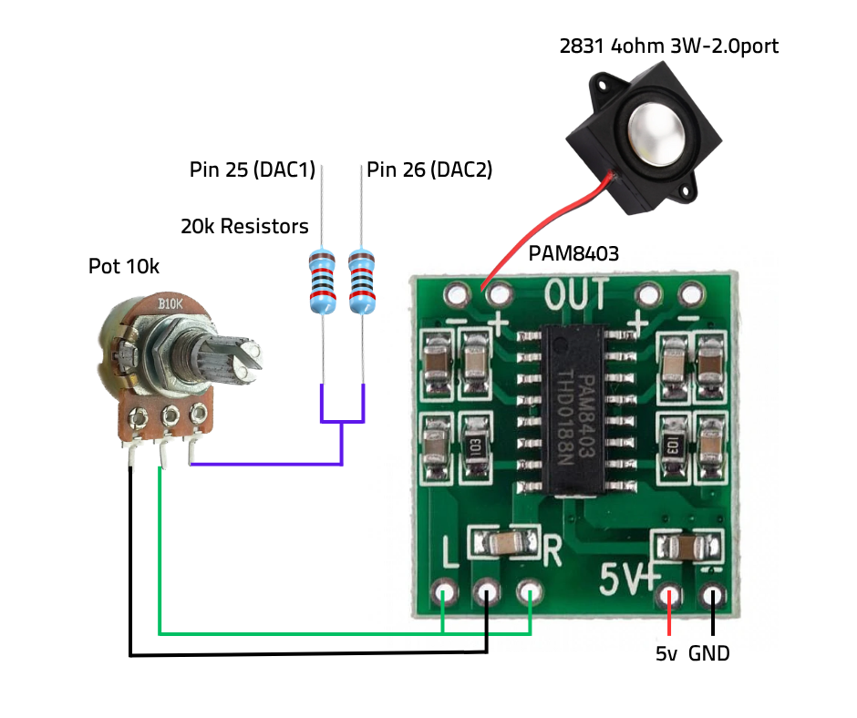

# BootCamp - RC Vehicle Control System
<!-- ALL-CONTRIBUTORS-BADGE:START - Do not remove or modify this section -->
[](#contributors-)
<!-- ALL-CONTRIBUTORS-BADGE:END -->

**BootCamp** is a wireless remote control system for multiple RC vehicles using ESP32 microcontrollers with ESP-NOW communication protocol. The system supports controlling different vehicle types (excavator, dump truck, semi-trailer, and forklift) from a single base station controller.

## System Overview

BootCamp implements a **one-to-many** wireless control system where:
- **Base Station**: Receives input from a Bluetooth controller and broadcasts commands via ESP-NOW
- **Vehicle Receivers**: Each vehicle has an ESP32 that receives commands and controls motors/servos
- **Controller Support**: Xbox and PS4/DualShock controllers supported
- **Multi-Vehicle**: Switch between vehicles using controller buttons

## Project Structure

```
BootCamp/
├── src/
│   ├── base.cpp        # Base station (controller receiver & ESP-NOW transmitter)
│   ├── excavator.cpp   # Excavator vehicle controller
│   ├── dump.cpp        # Dump truck vehicle controller
│   ├── semi.cpp        # Semi-trailer vehicle controller
│   ├── fork.cpp        # Forklift vehicle controller
├── platformio.ini      # Build configurations for each vehicle
├── lib/                # Project libraries
├── include/            # Header files
└── test/               # Test files
```

## Vehicle Types & Features

BootCamp is designed for RC vehicles created by **ProfessorBoots**. For detailed vehicle designs, build instructions, and 3D printable files:
- **Website**: [professorboots.com](https://professorboots.com/)
- **GitHub**: [ProfessorBoots GitHub](https://github.com/ProfBoots)

### Supported Vehicles:
- 🚜 **Excavator** (Receiver Index: 1)
- 🏗️ **Forklift** (Receiver Index: 2)
- 🚛 **Dump Truck** (Receiver Index: 3)
- 🚚 **Semi-Trailer** (Receiver Index: 4)

### Coming Soon:
- 🏗️ **Crane** (Receiver Index: TBD) - *Not yet implemented*
- 🚜 **SkidSteer** (Receiver Index: TBD) - *Not yet implemented*

Each vehicle features realistic movement controls, working lights, and specialized functions appropriate to the vehicle type. BootCamp's wireless control system allows seamless switching between vehicles using controller buttons.

## Hardware Requirements

### Base Station
- ESP32 Development Board
- Bluetooth controller (Xbox or PS4/DualShock)

### Each Vehicle
- ESP32 Development Board
- Vehicle-specific components as designed by ProfessorBoots
- Motor drivers, servo motors, sensors (per vehicle design)
- Power supply system

**For detailed hardware specifications, wiring diagrams, and build instructions:**
- **Website**: [professorboots.com](https://professorboots.com/)
- **GitHub**: [ProfessorBoots GitHub](https://github.com/ProfBoots)

## Software Setup

### Prerequisites
- [PlatformIO](https://platformio.org/) installed
- ESP32 development environment configured

### Installation

1. **Clone the repository:**
   ```bash
   git clone <repository-url>
   cd BootCamp
   ```

2. **Configure controller type** (base station):
   Edit `src/base.cpp` and select your controller:
   ```cpp
   // For Xbox controllers:
   #define CONTROLLER_XBOX
   // #define CONTROLLER_PS4

   // For PS4 controllers:
   // #define CONTROLLER_XBOX
   #define CONTROLLER_PS4
   ```

3. **Important: Uninstall espressif32 package before building base:**
   ```bash
   pio pkg uninstall -p espressif32
   ```

4. **Build and upload base station:**
   ```bash
   pio run -e base --target upload
   ```

4. **Build and upload vehicle firmware:**
   ```bash
   # For excavator:
   pio run -e excavator --target upload

   # For dump truck:
   pio run -e dump --target upload

   # For semi-trailer:
   pio run -e semi --target upload

   # For forklift:
   pio run -e fork --target upload
   ```

## Usage

### Controller Operations

#### **Basic Vehicle Control**
- **Left Stick**: Primary movement (forward/backward, steering)
- **Right Stick**: Secondary functions (varies by vehicle)
- **D-Pad**: Auxiliary functions
- **Shoulder Buttons**: Additional controls
- **Face Buttons**: Vehicle-specific functions

#### **Vehicle Switching**
Use the misc buttons on your controller to switch between vehicles:
- **Forward Button**: Next vehicle (increment receiver index)
- **Backward Button**: Previous vehicle (decrement receiver index)
- **Reset Button**: Return to receiver index 0

**Button Mappings:**
- **Xbox**: Guide button area controls
- **PS4**: Share/Options/PS button controls

## Communication Protocol

### ESP-NOW Message Structure
```cpp
typedef struct {
    uint32_t receiverIndex;    // Vehicle identifier (0-6)
    uint16_t buttons;          // Button state bitmask
    uint8_t dpad;             // D-pad state
    int32_t axisX, axisY;     // Left stick values
    int32_t axisRX, axisRY;   // Right stick values
    uint32_t brake, throttle; // Trigger values
    uint16_t miscButtons;     // Misc button bitmask
    bool thumbR, thumbL;      // Thumb button states
    bool r1, l1, r2, l2;     // Shoulder button states
} struct_message;
```

### Receiver Indices
- **0**: No vehicle selected
- **1**: Excavator
- **2**: Forklift
- **3**: Dump Truck
- **4**: Semi-Trailer
- **5**: Crane *(Coming Soon)*
- **6**: SkidSteer *(Coming Soon)*

## Troubleshooting

### Common Issues

**Base station build fails:**
- Make sure you ran `pio pkg uninstall -p espressif32` before building
- This is required due to a dependency conflict with the ESP32 Bluetooth library

**Controller not connecting:**
- Ensure correct controller type is selected in `base.cpp`
- Check Bluetooth pairing
- Verify ESP32 is in pairing mode

**Vehicle not responding:**
- Check receiver index matches vehicle
- Verify ESP-NOW initialization
- Check power supply to vehicle ESP32

**Inconsistent control:**
- Check for controller drift (calibration may be needed)
- Verify signal strength between base and vehicle
- Check for interference

### Debug Information

Monitor serial output for debugging:
```bash
pio device monitor -e base
```

The base station outputs:
- Controller connection status
- Button mappings being used
- Receiver index changes
- ESP-NOW transmission status

## Development

### Adding New Vehicles

1. **Create new source file** in `src/` directory
2. **Add environment** to `platformio.ini`:
   ```ini
   [env:newvehicle]
   platform = espressif32@6.10.0
   board = esp32doit-devkit-v1
   framework = arduino
   build_src_filter = +<newvehicle.cpp>
   lib_deps =
     madhephaestus/ESP32Servo @ 3.0.6
   ```
3. **Implement ESP-NOW receiver** following existing patterns
4. **Set unique receiver index**
5. **Implement vehicle-specific control logic**

### Code Conversion Notes

The original project used Arduino `.ino` files with direct Bluetooth controller connections. This has been converted to:
- **PlatformIO C++ structure** for better organization
- **ESP-NOW communication** for multi-vehicle support
- **Centralized base station** for controller management

## Hardware Connections

### Pin Assignments

**For detailed wiring diagrams and pin assignments:**
- **Website**: [professorboots.com](https://professorboots.com/)
- **GitHub**: [ProfessorBoots GitHub](https://github.com/ProfBoots)

**Common ESP32 Pins:**
- Motor control: Various GPIO pins (vehicle-specific)
- Servo control: PWM-capable pins
- I2C (if used): GPIO 21 (SDA), GPIO 22 (SCL)
- Status LED: GPIO 2 (built-in)

**Pin assignments for each vehicle type are documented in the respective source files and ProfessorBoots' vehicle designs.**

## Sound System (Semi-Truck)

The BootCamp project now features a realistic sound system for the semi-truck, with plans to extend to other vehicles in the future. This system provides engine startup, idle, revving, and horn sounds using the ESP32's DAC capabilities.

### Sound Features

- **Engine Startup Sound**: Plays automatically when controller connects to the vehicle
- **Engine Idle Sound**: Continuous background engine noise
- **Engine Revving**: Throttle-dependent engine revving when accelerating
- **Horn**: Press left thumbstick to activate horn
- **Sound Toggle**: Press Square button (PS4) to toggle sounds on/off

### Implementation Details

The sound system uses two key components:
1. **Hardware Timer Interrupt**: For consistent, high-quality audio playback
2. **Audio Mixing**: Multiple sound samples mixed in real-time

Sound files are stored as raw 8-bit PCM data in header files:
- `sounds/start.h` - Engine startup sound
- `sounds/idle.h` - Engine idle loop
- `sounds/rev.h` - Engine revving sound
- `sounds/horn.h` - Horn sound

### Sound Configuration Parameters

```cpp
// Rev sound configuration
volatile int revVolumePercentage = 150;         // Rev sound volume
volatile int engineRevVolumePercentage = 50;    // Engine idle volume when revving
volatile const uint16_t revSwitchPoint = 3;     // Throttle threshold to start rev sound
volatile const uint16_t idleEndPoint = 50;      // Throttle point for 100% rev, 0% idle
volatile const uint16_t idleVolumeProportionPercentage = 90; // Idle volume proportion
```

### Hardware Connections

The semi-truck sound system uses the ESP32's built-in DAC pins:
- **DAC1** (Pin 25, auxAttach4): Audio output
- **DAC2** (Pin 26, auxAttach5): Audio output (duplicated for stereo-like effect)

#### Audio Output Schematic



**Note:** The current revving implementation is functional but needs further tuning for more realistic engine sound. Future updates will improve this aspect.

### Customizing Engine Sounds

You can replace the default engine sounds with custom sounds from the [Rc_Engine_Sound_ESP32](https://github.com/TheDIYGuy999/Rc_Engine_Sound_ESP32) repository, which offers a variety of realistic engine sounds.

#### Steps to Change Sound Files:

1. **Download Sound Files**: 
   - Visit [TheDIYGuy999/Rc_Engine_Sound_ESP32](https://github.com/TheDIYGuy999/Rc_Engine_Sound_ESP32)
   - Navigate to the `/src/vehicles/sounds` directory
   - Browse and select your preferred engine sound set (e.g., DefenderV8, Mustang, Semi, etc.)

2. **Replace Header Files**:
   - Copy the selected engine's `.h` files:
     - `[ENGINE]_idle.h` → rename to `idle.h`
     - `[ENGINE]_rev.h` → rename to `rev.h`
     - `[ENGINE]_start.h` → rename to `start.h`
   - Place these files in the `src/sounds/` directory of your BootCamp project

3. **Update Sample Rates** (if required):
   - If changing to a sound with a different sample rate, update these variables:
   ```cpp
   #define sampleRate 22050    // Sample rate for idle sound
   #define revSampleRate 22050 // Sample rate for rev sound
   ```

4. **Adjust Sound Parameters**:
   - Fine-tune parameters in `semi.cpp` for the new sounds:
   ```cpp
   // Increase/decrease volume
   volatile int revVolumePercentage = 150;
   
   // Change the throttle threshold to trigger rev sound
   volatile const uint16_t revSwitchPoint = 3;
   
   // Adjust crossfade between idle and rev sounds
   volatile const uint16_t idleEndPoint = 50;
   volatile const uint16_t idleVolumeProportionPercentage = 90;
   ```

5. **Rebuild and Upload**:
   ```bash
   pio run -e semi --target upload
   ```

#### Notes on Sound Files:

- Sound files are raw 8-bit PCM data stored as C arrays
- Each engine in the Rc_Engine_Sound_ESP32 repository has a distinct character
- Higher sample rates (22050Hz) provide better quality but use more memory

## Safety Considerations

- **Always test in safe environment** before full operation
- **Ensure emergency stop capability**
- **Check battery levels** before operation
- **Verify control response** after any changes
- **Maintain clear line of sight** for ESP-NOW communication

## Credits

**Vehicle Designs**: All RC vehicles are designed by **ProfessorBoots**
- **Website**: [professorboots.com](https://professorboots.com/) - Plans, instructions, and resources
- **GitHub**: [ProfessorBoots GitHub](https://github.com/ProfBoots) - 3D printable files and code
- Original vehicle designs and mechanical engineering by ProfessorBoots
- BootCamp provides the wireless control system software for his vehicle designs

## License

[Add your license information here]

## Contributing

[Add contribution guidelines here]

## Support

For issues and questions:
- **BootCamp Software/Control System**: Check the troubleshooting section, review serial monitor output
- **Vehicle Hardware/Mechanical**: Visit [professorboots.com](https://professorboots.com/) or [ProfessorBoots GitHub](https://github.com/ProfBoots)
- Verify hardware connections and power supply

---

*BootCamp demonstrates advanced ESP32 capabilities including wireless communication, multi-device coordination, and real-time control systems for ProfessorBoots' RC vehicle designs.*

## Contributors ✨

Thanks go to these wonderful people ([emoji key](https://allcontributors.org/docs/en/emoji-key)):
<!-- ALL-CONTRIBUTORS-LIST:START - Do not remove or modify this section -->
<!-- prettier-ignore-start -->
<!-- markdownlint-disable -->
<table>
  <tbody>
    <tr>
      <td align="center" valign="top" width="14.28%"><a href="https://github.com/daltonpearson"><br /><sub><b>Dalton Pearson</b></sub></a><br /><a href="https://github.com/daltonpearson/BootCamp/commits?author=daltonpearson" title="Code">💻</a> <a href="#ideas-daltonpearson" title="Ideas, Planning, & Feedback">🤔</a> <a href="#projectManagement-daltonpearson" title="Project Management">📆</a> <a href="#maintenance-daltonpearson" title="Maintenance">🚧</a></td>
      <td align="center" valign="top" width="14.28%"><a href="https://github.com/PaulHam211"><br /><sub><b>PaulHam211</b></sub></a><br /><a href="https://github.com/daltonpearson/BootCamp/commits?author=PaulHam211" title="Code">💻</a> <a href="https://github.com/daltonpearson/BootCamp/commits?author=PaulHam211" title="Documentation">📖</a> <a href="#ideas-PaulHam211" title="Ideas, Planning, & Feedback">🤔</a></td>
    </tr>
  </tbody>
  <tfoot>
    <tr>
      <td align="center" size="13px" colspan="7">
        
          <a href="https://all-contributors.js.org/docs/en/bot/usage">Add your contributions</a>
        </img>
      </td>
    </tr>
  </tfoot>
</table>

<!-- markdownlint-restore -->
<!-- prettier-ignore-end -->

<!-- ALL-CONTRIBUTORS-LIST:END -->


This project follows the [all-contributors](https://allcontributors.org) specification.
Contributions of any kind are welcome!
